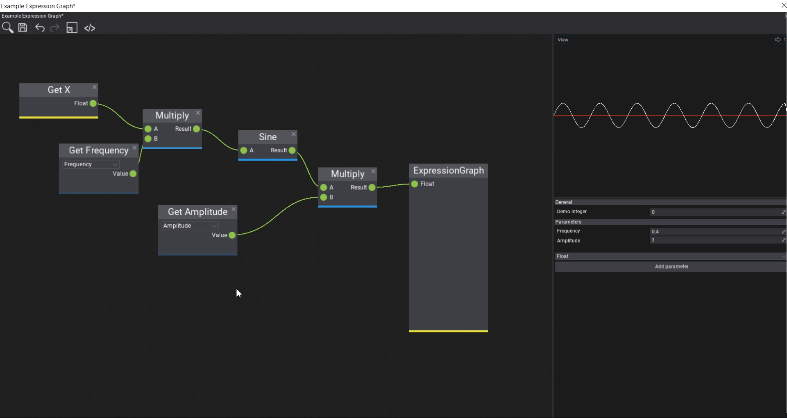

# Custom Visject Surfaces with Plugins

The Flax Engine has a visual scripting language called Visject. It's used by Materials, Particles, and Animations. It offers a wide range of features to be used by content creation tools.

You can also use it for your own purposes which can range from a simple graphing plugin to a full-blown scripting system. This plugin is a demonstration of it. Make sure to also check out the [graphing-demo branch](https://github.com/stefnotch/flax-custom-visject-plugin/tree/graphing-demo)

## Documentation
[Official Documentation](https://docs.flaxengine.com/manual/editor/advanced/custom-visject-surface.html)

## Gif

