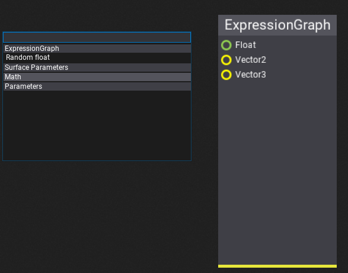

[TOC]

# Custom Visject Surfaces with Plugins

The FlaxEngine has a visual scripting language called Visject. It's used for the [material graph], the [particle graph] and the [animation graph]. It's a nice and easy way to things done.

You can also use it for your own purposes which can range from a simple graphing plugin to a fully blown scripting system.

These tutorials will go over the process of creating your own Visject surface for an expression graph. Something very simple that takes a few numbers, performs a few calculations and spits out a number. It's recommended to first go over the [custom plugin tutorials].


## Asset 

The first step is creating our own asset type. This asset type needs a `byte[]` to save the Visject Surface. 

It also needs a version of the graph that you can execute in a built game. This part will be covered in a later tutorial.

```csharp
public class ExpressionGraph
{
    /// <summary>
    /// Serialized Visject surface
    /// </summary>
    public byte[] VisjectSurface { get; set; }

    // TODO: Stuff that you can execute in a built game
}
```

This asset type will be a [json asset].


## Asset Proxy

To create and open assets using the Flax Editor, an asset proxy is required. Since it's an editor file, it needs to be in the editor assembly. To do so, create a new folder called `Editor`. In this folder, create an asset proxy. 

```csharp
public class ExpressionGraphProxy : JsonAssetProxy // JSON files
{
    /// <inheritdoc />
    public override string Name => "Expression Graph";

    /// <inheritdoc />
    // Will be implemented in the next step
    //public override EditorWindow Open(FlaxEditor.Editor editor, ContentItem item)
    //{
    //    return new ExpressionGraphWindow(editor, (JsonAssetItem)item);
    //}

    /// <inheritdoc />
    public override Color AccentColor => Color.FromRGB(0x0F0371);

    /// <inheritdoc />
    public override ContentDomain Domain => ContentDomain.Other;

    /// <inheritdoc />
    public override string TypeName { get; } = typeof(ExpressionGraph).FullName;

    /// <inheritdoc />
    public override bool CanCreate(ContentFolder targetLocation)
    {
        return targetLocation.CanHaveAssets;
    }

    /// <inheritdoc />
    public override void Create(string outputPath, object arg)
    {
        FlaxEditor.Editor.SaveJsonAsset(outputPath, new ExpressionGraph());
    }
}
```

### Register the proxy

Then, we have to use an editor [plugin] to register the proxy. 

> ![Note]
>
> Note: Make sure to add it *before* the `GenericJsonAssetProxy`, which is the last proxy in the list and is used as a fallback proxy.

```csharp
public class ExpressionGraphPlugin : EditorPlugin
{
    private ExpressionGraphProxy _expressionGraphProxy;
    
    /// <inheritdoc />
    public override void InitializeEditor()
    {
        base.InitializeEditor();

        _expressionGraphProxy = new ExpressionGraphProxy();
        // Register the proxy
        Editor.ContentDatabase.Proxy.Insert(0, _expressionGraphProxy);
    }

    /// <inheritdoc />
    public override void Deinitialize()
    {
        Editor.ContentDatabase.Proxy.Remove(_expressionGraphProxy);
        base.Deinitialize();
    }
}
```


Once this is done, you should be able to create a new expression graph asset in your `Content` folder.


## Visject Window

Opening the expression graph is currently rather disappointing. So, in this step, we'll create our own window with a Visject surface for it. Such a window has an asset, a surface, a live-preview and a number of parameters.

### Basic Implementation

To do so, we create a file in the `Editor` folder that inherits from `VisjectSurfaceWindow`. We'll also need a preview and a surface in the `Editor` folder.

```csharp
public class ExpressionGraphPreview : AssetPreview
{
    // Preview will be expanded later
    public ExpressionGraphPreview(bool useWidgets) : base(useWidgets)
    {
    }
    
    public ExpressionGraph ExpressionGraph { get; set; }
}
```

```csharp
public class ExpressionGraphSurface : VisjectSurface
{
    public const int MainNodeGroupId = 1;
    public const int MainNodeTypeId = 1;
    
    // Surface will be expanded later
    public ExpressionGraphSurface(IVisjectSurfaceOwner owner, Action onSave, FlaxEditor.Undo undo = null, SurfaceStyle style = null, List<GroupArchetype> groups = null) : base(owner, onSave, undo, style, groups)
    {
    }
}
```

```csharp
public class ExpressionGraphWindow : VisjectSurfaceWindow<JsonAsset, ExpressionGraphSurface, ExpressionGraphPreview>
{
    /// <summary>
    /// The properties proxy object.
    /// </summary>
    private sealed class PropertiesProxy
    {
        [EditorOrder(1000), EditorDisplay("Parameters"), CustomEditor(typeof(ParametersEditor)), NoSerialize]
        // ReSharper disable once UnusedAutoPropertyAccessor.Local
        public ExpressionGraphWindow WinRef { get; set; }

        [EditorOrder(20), EditorDisplay("General"), Tooltip("It's for demo purposes")]
        public int DemoInteger { get; set; }

        /// <summary>
        /// Custom editor for editing parameters collection.
        /// </summary>
        /// <seealso cref="FlaxEditor.CustomEditors.CustomEditor" />
        public class ParametersEditor : CustomEditor
        {
            private static readonly object[] DefaultAttributes = { new LimitAttribute(float.MinValue, float.MaxValue, 0.1f) };

            private enum NewParameterType
            {
                Float = (int)ParameterType.Float
            }

            /// <inheritdoc />
            public override DisplayStyle Style => DisplayStyle.InlineIntoParent;

            /// <inheritdoc />
            public override void Initialize(LayoutElementsContainer layout)
            {
                var window = Values[0] as ExpressionGraphWindow;
                var asset = window?.Asset;
                if (asset == null || !asset.IsLoaded)
                {
                    layout.Label("Loading...");
                    return;
                }
                var parameters = window.Surface.Parameters;

                for (int i = 0; i < parameters.Count; i++)
                {
                    var p = parameters[i];
                    if (!p.IsPublic)
                        continue;

                    var pIndex = i;
                    var pValue = p.Value;
                    Type pType;
                    object[] attributes = null;
                    switch (p.Type)
                    {
                    case ParameterType.CubeTexture:
                        pType = typeof(CubeTexture);
                        break;
                    case ParameterType.Texture:
                    case ParameterType.NormalMap:
                        pType = typeof(Texture);
                        break;
                    case ParameterType.RenderTarget:
                    case ParameterType.RenderTargetArray:
                    case ParameterType.RenderTargetCube:
                    case ParameterType.RenderTargetVolume:
                        pType = typeof(RenderTarget);
                        break;
                    default:
                        pType = p.Value.GetType();
                        // TODO: support custom attributes with defined value range for parameter (min, max)
                        attributes = DefaultAttributes;
                        break;
                    }

                    var propertyValue = new CustomValueContainer(
                        pType,
                        pValue,
                        (instance, index) =>
                        {
                            var win = (ExpressionGraphWindow)instance;
                            return win.Surface.Parameters[pIndex].Value;
                        },
                        (instance, index, value) =>
                        {
                            // Set surface parameter
                            var win = (ExpressionGraphWindow)instance;
                            var action = new EditParamAction
                            {
                                Window = win,
                                Index = pIndex,
                                Before = win.Surface.Parameters[pIndex].Value,
                                After = value,
                            };
                            win.Surface.Undo.AddAction(action);
                            action.Do();
                        },
                        attributes
                    );

                    var propertyLabel = new DragablePropertyNameLabel(p.Name);
                    propertyLabel.Tag = pIndex;
                    propertyLabel.MouseLeftDoubleClick += (label, location) => StartParameterRenaming(pIndex, label);
                    propertyLabel.MouseRightClick += (label, location) => ShowParameterMenu(pIndex, label, ref location);
                    propertyLabel.Drag = DragParameter;
                    var property = layout.AddPropertyItem(propertyLabel);
                    property.Object(propertyValue);
                }

                if (parameters.Count > 0)
                    layout.Space(10);
                else
                    layout.Label("No parameters");

                // Parameters creating
                var paramType = layout.Enum(typeof(NewParameterType));
                paramType.Value = (int)NewParameterType.Float;
                var newParam = layout.Button("Add parameter");
                newParam.Button.Clicked += () => AddParameter((ParameterType)paramType.Value);
            }

            private DragData DragParameter(DragablePropertyNameLabel label)
            {
                var win = (ExpressionGraphWindow)Values[0];
                var parameter = win.Surface.Parameters[(int)label.Tag];
                return DragNames.GetDragData(SurfaceParameter.DragPrefix, parameter.Name);
            }

            /// <summary>
            /// Shows the parameter context menu.
            /// </summary>
            /// <param name="index">The index.</param>
            /// <param name="label">The label control.</param>
            /// <param name="targetLocation">The target location.</param>
            private void ShowParameterMenu(int index, Control label, ref Vector2 targetLocation)
            {
                var contextMenu = new ContextMenu();
                contextMenu.AddButton("Rename", () => StartParameterRenaming(index, label));
                contextMenu.AddButton("Delete", () => DeleteParameter(index));
                contextMenu.Show(label, targetLocation);
            }

            /// <summary>
            /// Adds the parameter.
            /// </summary>
            /// <param name="type">The type.</param>
            private void AddParameter(ParameterType type)
            {
                var win = Values[0] as ExpressionGraphWindow;
                var asset = win?.Asset;
                if (asset == null || !asset.IsLoaded)
                    return;

                var action = new AddRemoveParamAction
                {
                    Window = win,
                    IsAdd = true,
                    Name = "New parameter",
                    Type = type,
                };
                win.Surface.Undo.AddAction(action);
                action.Do();
            }

            /// <summary>
            /// Starts renaming parameter.
            /// </summary>
            /// <param name="index">The index.</param>
            /// <param name="label">The label control.</param>
            private void StartParameterRenaming(int index, Control label)
            {
                var win = (ExpressionGraphWindow)Values[0];
                var parameter = win.Surface.Parameters[index];
                var dialog = RenamePopup.Show(label, new Rectangle(0, 0, label.Width - 2, label.Height), parameter.Name, false);
                dialog.Tag = index;
                dialog.Renamed += OnParameterRenamed;
            }

            private void OnParameterRenamed(RenamePopup renamePopup)
            {
                var index = (int)renamePopup.Tag;
                var win = (ExpressionGraphWindow)Values[0];

                var action = new RenameParamAction
                {
                    Window = win,
                    Index = index,
                    Before = win.Surface.Parameters[index].Name,
                    After = renamePopup.Text,
                };
                win.Surface.Undo.AddAction(action);
                action.Do();
            }

            /// <summary>
            /// Removes the parameter.
            /// </summary>
            /// <param name="index">The index.</param>
            private void DeleteParameter(int index)
            {
                var win = (ExpressionGraphWindow)Values[0];

                var action = new AddRemoveParamAction
                {
                    Window = win,
                    IsAdd = false,
                    Index = index,
                };
                win.Surface.Undo.AddAction(action);
                action.Do();
            }
        }

        /// <summary>
        /// Gathers parameters from the specified window.
        /// </summary>
        /// <param name="window">The window.</param>
        public void OnLoad(ExpressionGraphWindow window)
        {
            // Link
            WinRef = window;
        }

        /// <summary>
        /// Clears temporary data.
        /// </summary>
        public void OnClean()
        {
            // Unlink
            WinRef = null;
        }
    }

    private readonly PropertiesProxy _properties;

    private ExpressionGraph _assetInstance;

    /// <inheritdoc />
    public ExpressionGraphWindow(FlaxEditor.Editor editor, AssetItem item)
    : base(editor, item)
    {
        // Asset preview
        _preview = new ExpressionGraphPreview(true)
        {
            Parent = _split2.Panel1
        };

        // Asset properties proxy
        _properties = new PropertiesProxy();
        _propertiesEditor.Select(_properties);

        // Surface
        _surface = new ExpressionGraphSurface(this, Save, _undo)
        {
            Parent = _split1.Panel1,
            Enabled = false
        };

        // Toolstrip
        _toolstrip.AddSeparator();
        _toolstrip.AddButton(editor.Icons.BracketsSlash32, () => ShowSourceCode(_asset)).LinkTooltip("Show generated shader source code");
    }

    /// <summary>
    /// Shows the source code window.
    /// </summary>
    /// <param name="asset">The asset.</param>
    public static void ShowSourceCode(JsonAsset asset)
    {
        FlaxEditor.Utilities.Utils.ShowSourceCode(asset.Data, "Asset JSON");
    }

    /// <inheritdoc />
    protected override void UnlinkItem()
    {
        _properties.OnClean();
        _preview.ExpressionGraph = null;

        base.UnlinkItem();
    }

    /// <inheritdoc />
    protected override void OnAssetLinked()
    {
        _assetInstance = _asset.CreateInstance<ExpressionGraph>();
        _preview.ExpressionGraph = _assetInstance;

        base.OnAssetLinked();
    }

    /// <inheritdoc />
    public override string SurfaceName => "Expression Graph";

    /// <inheritdoc />
    public override byte[] SurfaceData
    {
        get => ExpressionGraphSurface.LoadSurface(_asset, _assetInstance, true);
        set
        {
            // Save data to the temporary asset
            if (ExpressionGraphSurface.SaveSurface(_asset, _assetInstance, value))
            {
                // Error
                _surface.MarkAsEdited();
                Debug.LogError("Failed to save surface data");
            }
            // Optionally reset the preview
        }
    }

    /// <inheritdoc />
    protected override bool LoadSurface()
    {
        // Init asset properties and parameters proxy
        _properties.OnLoad(this);

        // Load surface data from the asset
        byte[] data = ExpressionGraphSurface.LoadSurface(_asset, _assetInstance, true);
        if (data == null)
        {
            // Error
            Debug.LogError("Failed to load expression graph surface data.");
            return true;
        }

        // Load surface graph
        if (_surface.Load(data))
        {
            // Error
            Debug.LogError("Failed to load expression graph surface.");
            return true;
        }

        return false;
    }

    /// <inheritdoc />
    protected override bool SaveSurface()
    {
        _surface.Save();
        // TODO: Graph compilation (or maybe it should be in SurfaceData.set?)
        return false;
    }
}
```


### Saving and Loading

Usually an asset has a `SaveSurface` and a `LoadSurface` method. To implement those methods, we need to call functions from the editor assembly such as `FlaxEditor.Editor.SaveJsonAsset`. However, we can't reference the editor assembly from the game assembly(???), so we'll have to put those functions somewhere else. `ExpressionGraphSurface.cs` seems like a nice candidate for them.

The surface loading method tried to load the surface from an ExpressionGraph instance. If the surface doesn't exist yet, it creates a new Visject surface context, adds the root node and returns that.

The surface saving method saves the surface to the asset instance. It then saves the asset instance as json to the hard drive.

```csharp
/// <summary>
/// For saving and loading surfaces
/// </summary>
private class FakeSurfaceContext : ISurfaceContext
{
    public string SurfaceName => throw new NotImplementedException();

    public byte[] SurfaceData { get; set; }

    public void OnContextCreated(VisjectSurfaceContext context)
    {

    }
}

/// <summary>
/// Tries to load surface graph from the asset.
/// </summary>
/// <param name="createDefaultIfMissing">True if create default surface if missing, otherwise won't load anything.</param>
/// <returns>Loaded surface bytes or null if cannot load it or it's missing.</returns>
public static byte[] LoadSurface(JsonAsset asset, ExpressionGraph assetInstance, bool createDefaultIfMissing)
{
    if (!asset) throw new ArgumentNullException(nameof(asset));
    if (assetInstance == null) throw new ArgumentNullException(nameof(assetInstance));

    // Return its data
    if (assetInstance.VisjectSurface?.Length > 0)
    {
        return assetInstance.VisjectSurface;
    }

    // Create it if it's missing
    if (createDefaultIfMissing)
    {
        // A bit of a hack
        // Create a Visject Graph with a root node and serialize it!
        var surfaceContext = new VisjectSurfaceContext(null, null, new FakeSurfaceContext());

        // Add the root node
        // TODO: Change NodeFactory.DefaultGroups to your list of group archetypes
        var node = NodeFactory.CreateNode(NodeFactory.DefaultGroups, 1, surfaceContext, MainNodeGroupId, MainNodeTypeId);
        
        if (node == null)
        {
            Debug.LogWarning("Failed to create root node.");
            return null;
        }
        surfaceContext.Nodes.Add(node);
        node.Location = Vector2.Zero;
        surfaceContext.Save();
        return surfaceContext.Context.SurfaceData;
    }
    else
    {
        return null;
    }
}

/// <summary>
/// Updates the surface graph asset (save new one, discard cached data, reload asset).
/// </summary>
/// <param name="data">Surface data.</param>
/// <returns>True if cannot save it, otherwise false.</returns>
public static bool SaveSurface(JsonAsset asset, ExpressionGraph assetInstance, byte[] surfaceData)
{
    if (!asset) throw new ArgumentNullException(nameof(asset));

    assetInstance.VisjectSurface = surfaceData;

    bool success = FlaxEditor.Editor.SaveJsonAsset(asset.Path, assetInstance);
    asset.Reload();
    return success;
}
```

### Use the window

To actually use the window, we need to uncomment the following in `ExpressionGraphProxy.cs`

```csharp
public override EditorWindow Open(FlaxEditor.Editor editor, ContentItem item)
{
    return new ExpressionGraphWindow(editor, (JsonAssetItem)item);
}
```


Congratulations, you now have your own Visject surface.


## Custom Nodes

Every Visject node has a `NodeArchetype` , which specifies the type of the node. A number of `NodeArchetype`s are grouped together in a `GroupArchetype`.

To add custom nodes, we need to pass our own list of group archetypes to the surface's base constructor.

```csharp
public static readonly List<GroupArchetype> ExpressionGraphGroups = new List<GroupArchetype>();

public ExpressionGraphSurface(IVisjectSurfaceOwner owner, Action onSave, FlaxEditor.Undo undo = null, SurfaceStyle style = null) 
    : base(owner, onSave, undo, style, ExpressionGraphGroups) // Note the last parameter
{

}
```

And then we can fill our list of group archetypes with our own ones. We can also use existing node archetypes.

```csharp
// Our own node archetypes
public static readonly NodeArchetype[] ExpressionGraphNodes =
{
    // Main node
    new NodeArchetype
    {
        TypeID = 1,
        Title = "ExpressionGraph",
        Description = "Main number graph node",
        Flags = NodeFlags.AllGraphs | NodeFlags.NoRemove | NodeFlags.NoSpawnViaGUI | NodeFlags.NoCloseButton,
        Size = new Vector2(150, 300),
        Elements = new[]
        {
            NodeElementArchetype.Factory.Input(0, "Float", true, ConnectionType.Float, 0),
            NodeElementArchetype.Factory.Input(1, "Vector2", true, ConnectionType.Vector2, 1),
            NodeElementArchetype.Factory.Input(2, "Vector3", true, ConnectionType.Vector3, 2)
        }
    },
    // Random float
    new NodeArchetype
    {
        TypeID = 2,
        Title = "Random float",
        Description = "A random float",
        Flags = NodeFlags.AllGraphs,
        Size = new Vector2(150, 30),
        Elements = new[]
        {
            NodeElementArchetype.Factory.Output(0, "Float", ConnectionType.Float, 0),
        }
    }
};

// List of group archetypes
public static readonly List<GroupArchetype> ExpressionGraphGroups = new List<GroupArchetype>()
{
    // Our own nodes, including the main node
    new GroupArchetype
    {
        GroupID = 1,
        Name = "ExpressionGraph",
        Color = new Color(231, 231, 60),
        Archetypes = ExpressionGraphNodes
    },
    // All math nodes
    new GroupArchetype
    {
        GroupID = 3,
        Name = "Math",
        Color = new Color(52, 152, 219),
        Archetypes = FlaxEditor.Surface.Archetypes.Math.Nodes
    },
    // Just a single parameter node
    new GroupArchetype
    {
        GroupID = 6,
        Name = "Parameters",
        Color = new Color(52, 73, 94),
        Archetypes = new []{ FlaxEditor.Surface.Archetypes.Parameters.Nodes[0] }
    }
};
```


Lastly, we need to update the `LoadSurface` method to use the `ExpressionGraphGroups` instead of `NodeFactory.DefaultGroups`.

```csharp
var node = NodeFactory.CreateNode(ExpressionGraphGroups, 1, surfaceContext, MainNodeGroupId, MainNodeTypeId);
```





## Compiling and Running

To run the Visject surface in a built game, you need to create a runtime representation of it. For example, you could go over every node and turn it into shader code. Or you could copy the surface nodes and run a simple interpreter at runtime.

> ![Note]
>
> Note: You cannot reference `SurfaceNode` at runtime, because it is in the Editor assembly. So, you have to copy every single node to your own class if you want to write an interpreter.

A simple approach for doing so is to go over the surface in a *depth first* manner. This makes it easy to execute the nodes in a correct order, where every node gets executed *after* the nodes before it have finished.

### Depth First Traversal

The FlaxEngine provides a depth first traversal method, however it doesn't check for cycles. This means that you could potentially compile a graph with an infinite cycle in it and crash the interpreter at runtime. A simple replacement for the built-in depth first traversal *with cycle detection* can be written as follows

```csharp
private IEnumerable<SurfaceNode> DepthFirstTraversal(SurfaceNode startNode)
{
    List<SurfaceNode> output = new List<SurfaceNode>(Nodes.Count);
    // The states of a node are 
    // null  Nothing   (unvisited and not on the stack)
    // false Processing(  visited and     on the stack)
    // true  Completed (  visited and not on the stack)
    Dictionary<SurfaceNode, bool> nodeState = new Dictionary<SurfaceNode, bool>();
    Stack<SurfaceNode> toProcess = new Stack<SurfaceNode>(Nodes.Count);

    // Start processing the nodes (backwards)
    toProcess.Push(startNode);
    while (toProcess.Count > 0)
    {
        var node = toProcess.Peek();
        // We have never seen this node before
        if (!nodeState.ContainsKey(node))
        {
            // We are now processing it
            nodeState.Add(node, false);
        }
        else
        {
            // Otherwise, we are done processing it
            nodeState[node] = true;
            // Remove it from the stack
            toProcess.Pop();
            // And add it to the output
            output.Add(node);
        }

        // For all parents, push them onto the stack if they haven't been visited yet
        var elements = node.Elements;
        for (int i = 0; i < elements.Count; i++)
        {
            if (node.Elements[i] is InputBox box && box.HasAnyConnection)
            {
                if (box.HasSingleConnection)
                {
                    // Get the parent node
                    var parentNode = box.Connections[0].ParentNode;

                    // It has been visited previously
                    if (nodeState.TryGetValue(parentNode, out bool state))
                    {
                        if (state == false)
                        {
                            // It's still processing, so there must be a cycle!
                            throw new Exception("Cycle detected!");
                        }
                    }
                    else
                    {
                        // It hasn't been visited, add it to the stack
                        toProcess.Push(parentNode);
                    }
                }
                else
                {
                    throw new Exception("Input box has more than one connection");
                }
            }
        }
    }

    return output;
}
```


### Compiling the Surface Nodes


### Executing


### Preview


`<Screenshot>`

## Going Further

Graphing (executing the same thing, but with different coordinates)

`<Screenshot>`


```
in c++ we have in-build implicit casting for basic types, we could add some methdos to c#
Waiting for this...
```


## Custom Material Surface

TODO: How to inject nodes by replacing them with custom code nodez


```
            //window.Surface.Context.Saving
            //window.Surface.Context.Saved
            // How do you get the window or surface...
```

